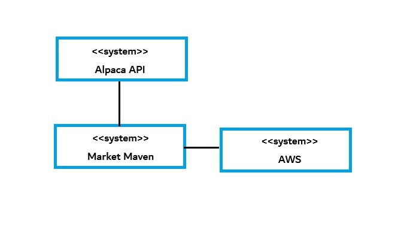
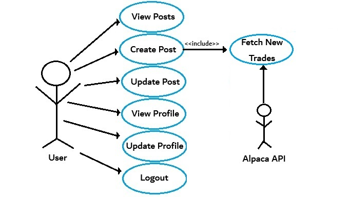
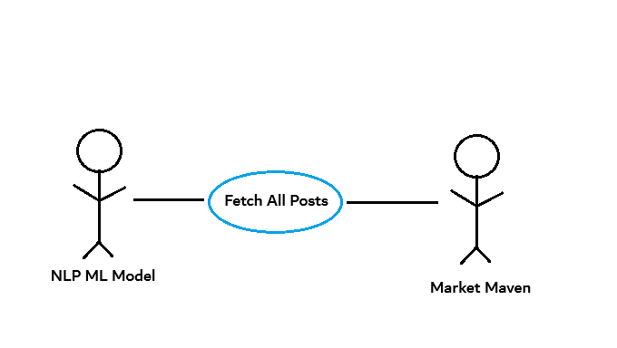

# Market Maven SRS Document

## Overview

**Market Maven** is an innovative application designed for retail traders to share and post their trading activities. The platform will facilitate a discourse community, where users can exchange trading philosophies and strategies. Real-time, verifiable user stats on their profiles will add credibility to their statements and insights.

---

## High-Level Solution Approach

Market Maven will leverage **Django** to create a robust, scalable, and maintainable backend. For development purposes, an **SQLite** database with three essential tables—**User**, **Profile**, and **Post**—will store the necessary data for users to post their trading activity and interact within the community. 

The **Trading Account API** will provide credible user profile statistics, ensuring the authenticity of the information shared by users. Market Maven will also utilize user data for market sentiment analysis by observing posts on particular stocks or sectors. By analyzing the vocabulary used in posts, Market Maven will classify sentiments as either bullish or bearish.

For the frontend, **React** will be used alongside Django's **REST Framework** to create a seamless interaction between the backend and the user interface, enhancing the user experience.

---

## Analysis Approach / Technology Choices

Initially, cloud-based solutions seemed ideal for the backend of Market Maven. However, after encountering API reliability issues, I opted to use a local SQL database (SQLite) for ease of implementation. During this exploration, I discovered **Django**, a Python-based web framework that supports SQLite out of the box and allows for a future transition to **PostgreSQL** when scaling for production. 

Django's ease of use for backend development and its integration capabilities with a Python-based **NLP** model made it an ideal choice. For frontend development, Django's reliance on basic HTML could be limiting, but I solved this by integrating **React** with Django via the **Django REST Framework**, which provides a clean and efficient way to connect the frontend and backend.

---

## Context Model

### System Boundaries

Market Maven interacts with **Alpaca**'s API to retrieve users' trading activity. During development, all data will be stored locally in an **SQLite** database. Once the system is ready for production, migrating to **AWS** for improved scalability would be a good option.

---

## Use Case Diagram

### Use Cases:

#### 1. **View Posts**
   - **Actor**: User
   - **Description**: A user can view all posts from other users on Market Maven.
   - **Stimulus**: User clicks on the home page.
   - **Response**: Home page displays all posts in an organized layout.
   - **Data**: List of Post objects.
   
#### 2. **Create Post**
   - **Actor**: User
   - **Description**: A user can create a post by filling a form, which populates a **Post** object.
   - **Stimulus**: User wants to create a post after detecting new trades.
   - **Response**: Post is saved in the database and displayed on the home page.
   - **Data**: Post object.
   
#### 3. **Fetch New Trades**
   - **Actor**: Alpaca API
   - **Description**: Fetch new trades from Alpaca trading account after the user logs in.
   - **Stimulus**: User logs in with an Alpaca account.
   - **Response**: Returns all trades made after the last login time.
   - **Data**: Iterable datatype with new trades.

#### 4. **Update Post**
   - **Actor**: User
   - **Description**: Users can only update the content of their own posts.
   - **Stimulus**: User clicks the update button on a specific post.
   - **Response**: Post content is updated in the database.
   - **Data**: Updated content of the Post object.

#### 5. **View Profile**
   - **Actor**: User
   - **Description**: A logged-in user can view their own or another user's profile.
   - **Stimulus**: User clicks on their profile button or the username on a post.
   - **Response**: Profile page displays user details and their posted trades.
   - **Data**: Profile object and associated Post objects.

#### 6. **Update Profile**
   - **Actor**: User
   - **Description**: A user can update their own profile (username or profile image).
   - **Stimulus**: User clicks the update button on their profile page.
   - **Response**: Profile object is updated in the database.
   - **Data**: Username and profile image in Profile object.

#### 7. **Logout**
   - **Actor**: User
   - **Description**: A user logs out of the system.
   - **Stimulus**: User clicks the logout button.
   - **Response**: User is logged out and cannot update their profile or posts anymore.
   - **Data**: None.

#### 8. **Fetch All Posts (For Sentiment Analysis)**
   - **Actor**: NLP ML Model
   - **Description**: Fetch all posts to analyze sentiment about a particular stock, sector, etc.
   - **Stimulus**: Admin wants to analyze sentiment.
   - **Response**: Sentiment analysis is performed, and results are displayed.
   - **Data**: Iterable datatype with all Post objects.

---

## Backend Class Diagrams

#### Post
##### Data Members
- **ticker:** String  
- **author:** User object  
- **order_type:** String  
- **context:** String  
- **percent_gain:** Integer  

##### Methods
- `CreatePost(ticker, order_type, context, percent_gain, author) -> Post Object`  
- `UpdatePost(Post Object, new_content) -> Post Object`  
- `ViewPost(Post Object) -> Post Object`  

---

#### User
##### Data Members
- **username:** String  
- **gmail:** String  
- **password:** String  

---

#### Profile
##### Data Members
- **user:** User object  
- **image:** jpg  
- **capital_gain_YTD:** Integer  
- **rank:** String  
- **posts:** Array[Post object]  

